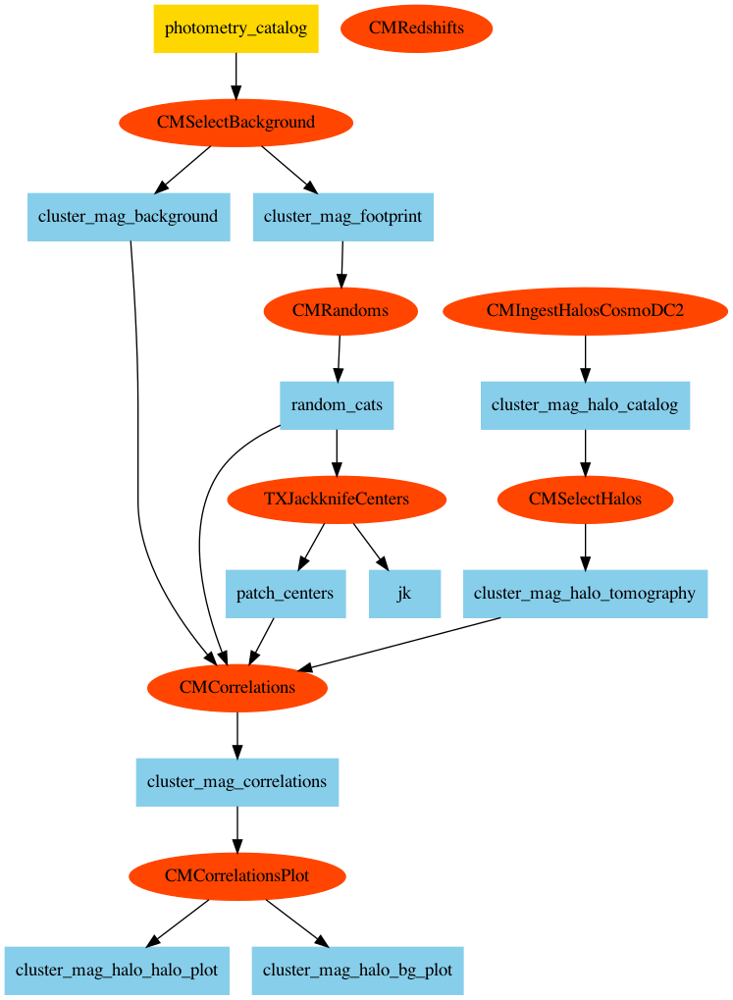

# Running the Cluster Magnification Code

This pipeline is a transcription of Marina's notebooks into TXPipe form.

It can run SkySim5000-sized data.

## Getting the code

The code needs to be run at NERSC on the command line for access to the data.
Note the perhaps unfamiliar `--recurse-submodules` flag!

    cd $SCRATCH
    git clone --recurse-submodules https://github.com/LSSTDESC/TXPipe

and checkout the branch for this work:

    cd TXPipe
    git checkout ricci-clusters

## Setting up environment

Most of the dependencies for this code are included in the txpipe shifter image.
We only need a very minimal environment here:

    source examples/nersc/setup
    python -m venv env
    source env/bin/activate
    pip install ceci numpy scipy parallel_statistics

## Looking at the pipline

Have a look at [the pipeline file we are going run](cluster_mag_skysim.yml) which specifies what code will be run and where its inputs and outputs go.

Also see the [the configuration file for that pipeline](cluster_mag_skysim_config.yml) which makes choices about various configurable parameters in the different parts of the pipeline.

This is the flow chart of the pipeline:

We generated this image using the `bin/flow_chart.py` script; this includes the ingestion stage that is commented out.

## Running the pipeline

Log into NERSC, and go to the TXPipe directory that you cloned above.

We will run this on interactive nodes, since it's usually fastest to get access.

    salloc -N 16 -C haswell  -t 3:00:00 -q interactive -A m1727
    source env/bin/activate

You can see what commands the pipeline will run using the dry-run flag:

    ceci --dry-run examples/cluster_mag/cluster_mag_skysim.yml

You can either run the commands it prints out manually, or you can
have the pipeline run them all for you like this:

    ceci examples/cluster_mag/cluster_mag_skysim.yml

If you do the latter, the logs from the pipeline will be put into files, instead of printed to screen (because multiple commands may be run at once).  You can look at those files while the pipeline is running by opening a new terminal and logging into NERSC from that.

## Results

Results will be put into the directory `data/cluster_mag_skysim/outputs`.  The final results plots are the `png` files.

If you want to make your own plots the results are all stored in the file `cluster_mag_correlations.sacc`.   You can read that file using the `sacc` library, which is available in `pip`. See the [sacc instructions](https://sacc.readthedocs.io/en/latest/intro.html#reading-sacc-objects).

## The code

The different pipeline stages are python class in [this directory](../../txpipe/extensions/cluster_mag).  The code machinery configures and runs these files based on the configuration files.

Note that the redshift stage currently does nothing!